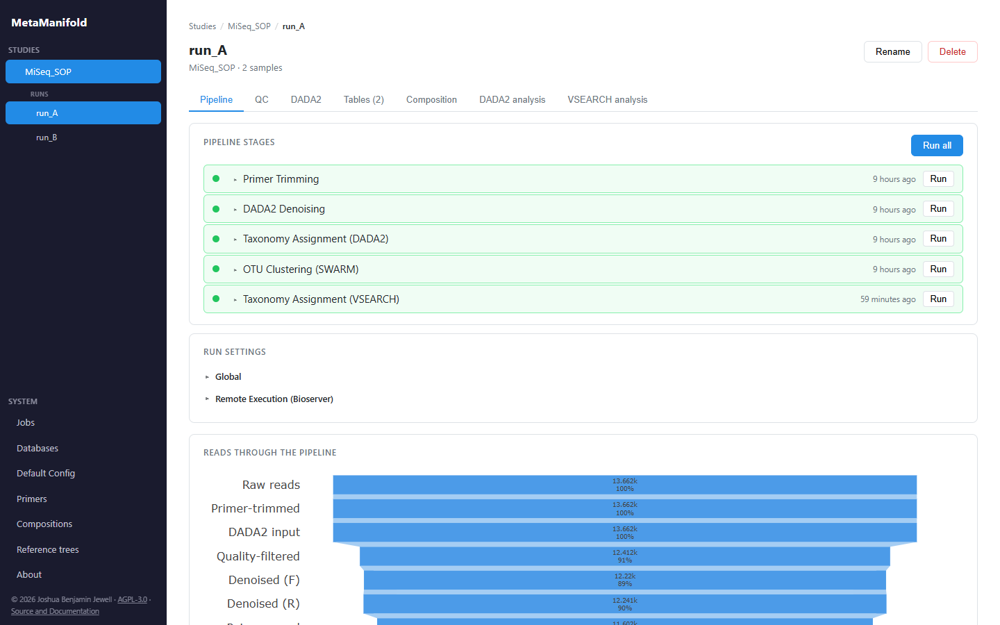
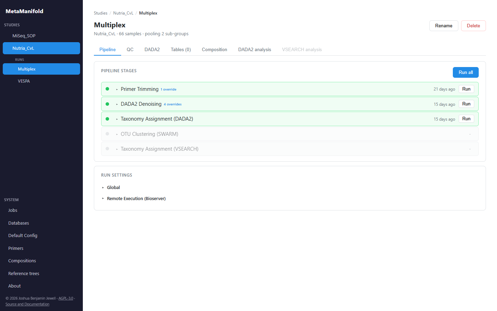
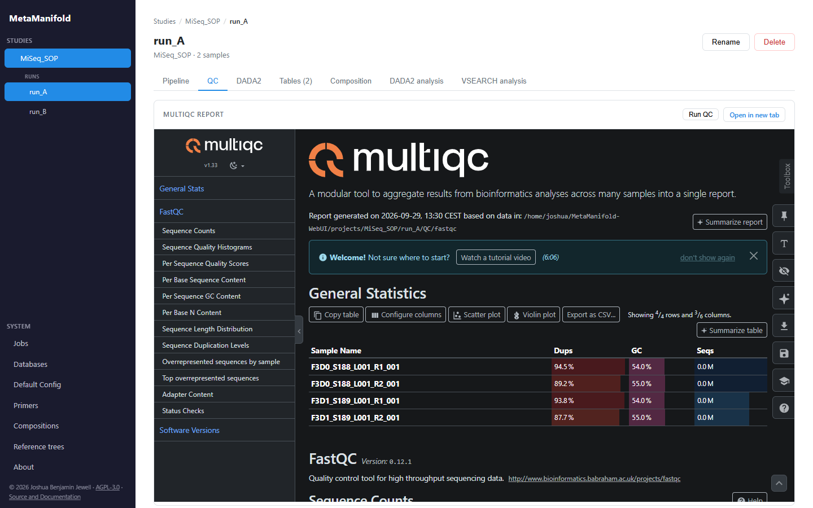
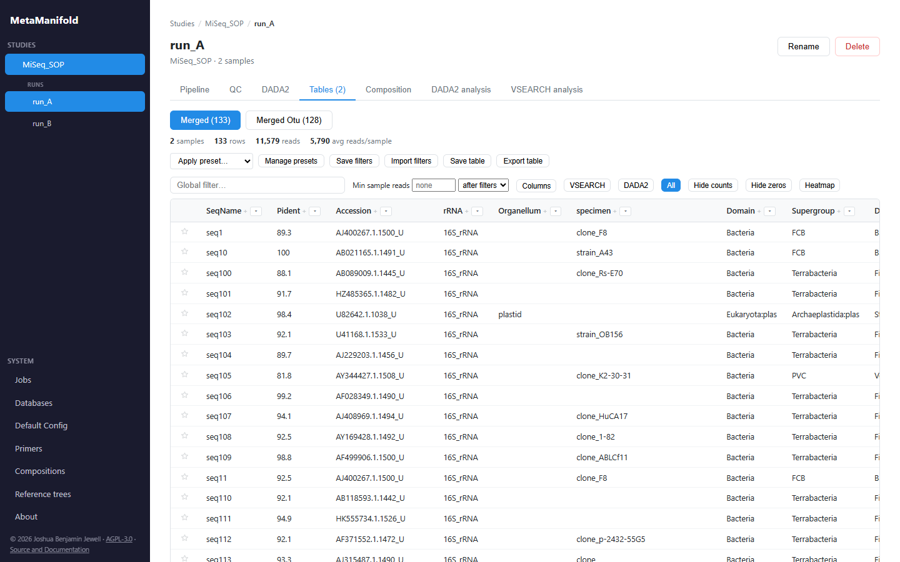
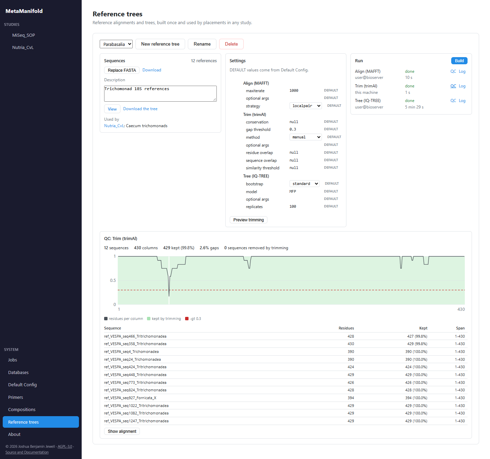
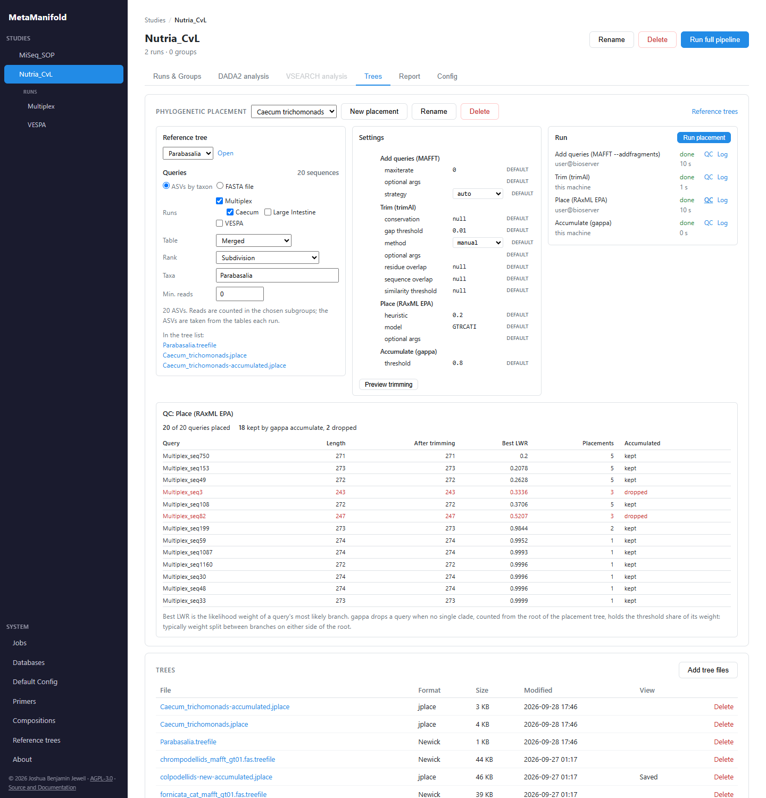
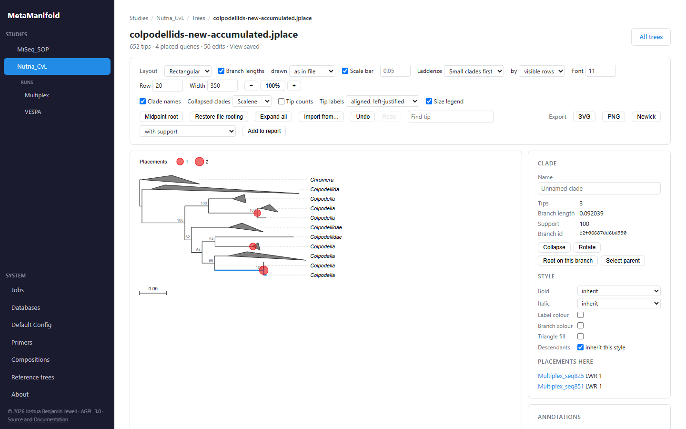
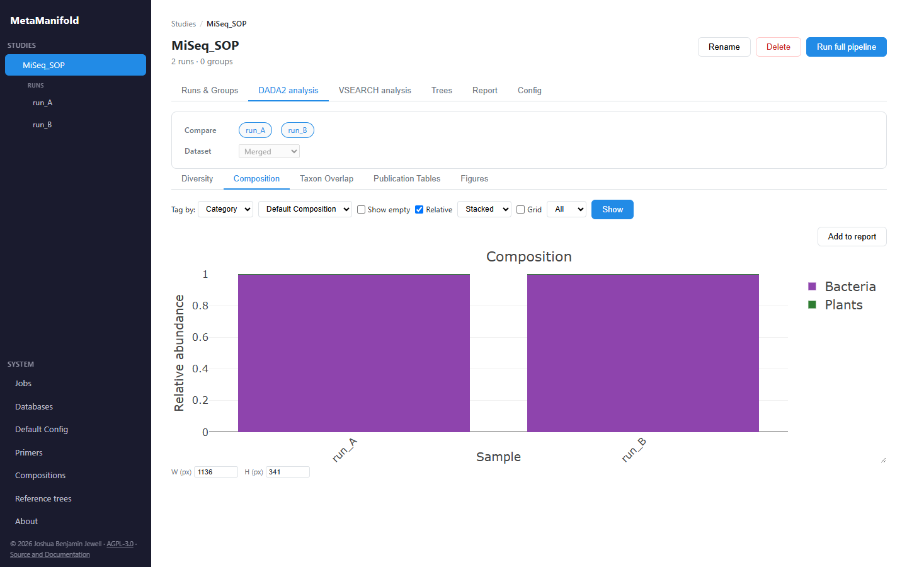
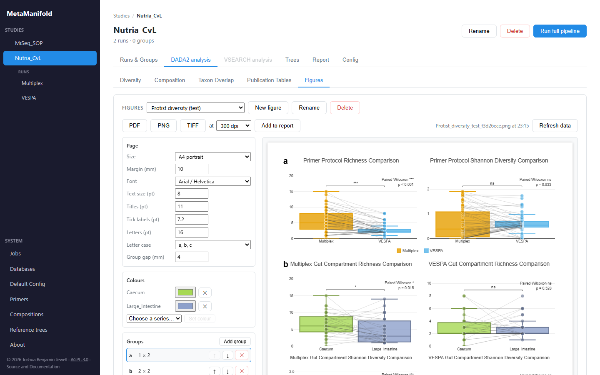

# MetaManifold

[](LICENSE)
[](https://julialang.org)
[](https://www.r-project.org)
[](https://github.com/JoshuaJewell/MetaManifold-WebUI/actions/workflows/ci.yml)
[](https://codecov.io/gh/JoshuaJewell/MetaManifold-WebUI)

MetaManifold wraps standard amplicon sequencing workflows into a single configurable Julia orchestrator: from raw paired-end Next Generation Sequencing reads through denoising, taxonomy assignment and taxonomic filtering, with interactive configuration and analysis in the browser.

<p align="center">
  
</p>

## Overview

MetaManifold consists of a Julia backend (pipeline engine + REST API) and a TypeScript/React frontend. The pipeline runs FastQC, MultiQC, cutadapt, DADA2, SWARM, vsearch, and cd-hit-est under the hood, and places ASVs on reference trees with MAFFT, trimAl, IQ-TREE, RAxML and gappa; results are stored in per-run DuckDB databases and served to the frontend as interactive Plotly charts and filterable tables. Pipeline configuration is editable directly in the web UI at every cascade level (see [Configuration](#configuration)).

**Pipeline stages**

```
Raw FASTQs  (data/{study}/[{group}/]{run}/*.fastq.gz)
      │
   cutadapt, primer trimming
      │
      ├────────────────────────────┐
      │                            │
   DADA2*, ASV;               SWARM*, OTU;
   filter & trim              merge pairs
   learn error rates          dereplicate
   denoise + merge            chimera filter
   length filter              cluster OTUs
   chimera removal                 │
   taxonomy assign*                │
      │                            │
   cd-hit-est*, demultiplex        │
      │                            │
   vsearch*                   vsearch, global alignment
      │                            │
      ├────────────────────────────┘
      │
   merge_taxa;
   join ASV tables*
   join counts-taxonomy
   apply filters
      │
   DuckDB results store
```
*optional

**Analysis**

Once a run completes, analysis is performed on request through the web UI, both per run and across runs within a study:

- Alpha diversity (richness, Shannon, Simpson), per sample or as cross-run comparison boxplots with significance testing and optional lines joining paired samples
- Taxonomic composition bar charts at a chosen rank, relative or absolute
- Organism-composition charts that classify ASVs/OTUs into biological categories (a "Composition" view, e.g. protozoa, helminths, fungi, host)
- Taxon overlap across runs as proportional Euler or UpSet plots
- Pipeline stage read-count summaries
- NMDS ordination (Bray-Curtis, via R/vegan)
- PERMANOVA, with PERMDISP to check for differences in dispersion (via R/vegan)

Counts may be normalised before analysis (none, rarefaction to a fixed or auto-resolved depth, or SRS — scaling with ranked subsampling, which reaches the same depth by scaling rather than resampling and so retains more of the community structure), and contamination-flagged taxa may be included or excluded. Ordinations may additionally apply a Hellinger transform before the Bray-Curtis dissimilarity. Composition charts can be drawn as a grid faceted on any two of run, group and sub-group. All analysis charts are returned as Plotly JSON and rendered interactively in the browser.

## Prerequisites

- **Julia** 1.12 (installed by `install.sh` if missing, and pinned to the Manifest version for this directory)
- **R** >= 4.0 (required for the DADA2 stage and NMDS/PERMANOVA analysis)
  - Ubuntu/Debian: `sudo apt install r-base`
  - macOS: `brew install r` or [CRAN package](https://cran.r-project.org/bin/macosx/)
- **bun** builds the frontend. The installer uses a bun on PATH at the version pinned in `config/defaults/tool_versions.yml`, or downloads that release into `bin/`.

## Installation

```bash
git clone https://github.com/JoshuaJewell/MetaManifold-WebUI.git
cd MetaManifold-WebUI
bash install.sh
```

`install.sh` installs Julia (via juliaup) if missing, checks for R (and stops
with install instructions if it is absent), then hands off to `install.jl`,
which installs the Julia dependencies, locates or downloads each external tool
(cutadapt, FastQC, MultiQC, vsearch, cd-hit-est, and the phylogeny tools MAFFT,
trimAl, IQ-TREE, RAxML and gappa), and reproduces the R
environment from `renv.lock`. It ends with a summary listing every dependency as
`OK`, `SKIPPED`, or `ACTION NEEDED`, so anything it could not finish itself is
stated explicitly rather than surfacing later as a broken pipeline stage. Tool
paths can be configured manually in `config/tools.yml`. MAFFT, IQ-TREE and RAxML
can be skipped on a machine that sends those stages to a server (see
[Threads and remote execution](#threads-and-remote-execution-top-level-of-pipelineyml));
trimAl and gappa always run locally.

`install.sh` does **not** install R itself, nor the system `-dev` headers the R
stack compiles against (both need root). Missing R stops the install with a
message telling you how to get it. If the build headers are incomplete the
installer does not start `renv::restore()` (it would compile for minutes and
then fail on the first package that needs one); instead the summary prints the
single command that installs every missing one — run it and re-run `install.sh`
to finish the R setup.

To update:
```bash
bash install.sh --update
```

### Reproducing the R environment

The R-side dependencies (DADA2, vegan, and their transitive packages) are
pinned with [`renv`](https://rstudio.github.io/renv/); `renv.lock` is the source
of truth and the committed `.Rprofile` activates the project-local library on
any `R`/`Rscript` invocation from the repository root. `install.sh` runs the
restore for you; to redo it by hand (e.g. after adding the missing headers):

```bash
Rscript -e 'renv::restore(prompt = FALSE)'
```

To add or upgrade a package, install it inside the project
(`renv::install(...)`) and record the change with `renv::snapshot()`.

### Tool paths

`install.sh` generates `config/tools.yml`, one local path per tool:

```yaml
vsearch:
  path: "/home/user/software/vsearch"
```

`config/defaults/tools.yml` contains the full config format. Work that runs on a
server is configured with the `remote` block of `pipeline.yml`, not here.

## Quick start

### 1. Place paired-end FASTQs under data/
Put `.fastq.gz` files into `data/MyProject/run_A`. 

### 2. Start the server
`bash start.sh`

The installer builds the frontend into `web/dist`, and `install.sh --update` rebuilds it. `start.sh` rebuilds it whenever a frontend source is newer than the build; `BUILD=1 bash start.sh` forces a rebuild.

### 3. Open http://localhost:8080

The web UI lets you create studies, configure pipeline parameters, launch runs, and explore results interactively. All state lives in the filesystem under `data/` and `projects/`.

| Environment variable      | Default           | Description   |
| ------------------------- | ----------------- | ------------- |
| `JULIA_METAMANIFOLD_PORT` | `8080`            | Server port   |
| `JULIA_METAMANIFOLD_ROOT` | working directory | Project root  |
| `JULIA_THREADS`           | `8`               | Julia threads |

Or run the Julia server directly:

```bash
julia --project=. scripts/serve.jl
```

The server is part of the `MetaManifold` package, so the first start after an
install or a source change compiles the package. That compile runs a workload of
the requests a first page visit makes, which takes a few minutes and caches
their native code. While developing, skip the workload with a
`LocalPreferences.toml` (git-ignored) in the repository root:

```toml
[MetaManifold]
precompile_workload = false
```

The server then makes those requests itself in the background as it starts, so the first page visit does not wait on compilation.

## Web interface

The browser interface is the primary way to drive MetaManifold. Beyond creating studies and launching runs, it offers the following:

### Editing configuration

Every pipeline setting can be edited in the UI without touching a YAML file. Configuration is presented as collapsible accordion sections (study design, primer trimming, DADA2 denoising and taxonomy, OTU clustering, analysis) and can be set at any level of the cascade: the instance-wide defaults, a study, a group, or an individual run. Edits at a finer level override coarser ones (see [Configuration](#configuration) for the cascade rules). When a setting changes, the affected pipeline stages are flagged as stale, so it is clear which outputs a re-run would regenerate; a tooltip lists exactly which keys changed and at which level.

### Pipeline runs and outputs

A run's page is the working surface for that run. It is where the run-level configuration above is edited, where the full pipeline or any individual stage (including the DADA2 substages) is launched, and where each stage's status is shown. Long-running jobs report progress live through a server-sent event stream, and the jobs panel lets you watch or cancel them. As stages complete, their outputs become available through the views that follow: quality reports, the results table and composition.

<p align="center">
  
</p>

### QC

Raw-read QC (FastQC aggregated by MultiQC) and the DADA2 quality, denoising, merging, and taxonomy diagnostics are embedded in the UI, each with the relevant per-stage configuration alongside and a re-run control.

<p align="center">
  
</p>

### Results explorer

Each run's merged taxonomy-and-count table, and any derived tables, can be browsed interactively. The table supports per-column filtering (text search, numeric range, include/exclude lists) and a global text filter, column sorting, configurable pagination, and column visibility toggles including taxonomy-source presets (VSEARCH-only, DADA2-only, or all) and a switch for the per-sample count columns. Sequences carry BLAST links, and OTU rows can be expanded to their constituent sequences. Frequently used filters can be saved as named presets and reapplied; filtered tables can be saved back into the run or exported to Excel (`.xlsx`).

<p align="center">
  
</p>

### Phylogenetic placement

Reference trees (under SYSTEM) are built once from uploaded reference sequences
and used by any study. A study's Trees tab places its ASVs on one of them: pick
runs and, for pooled runs, subgroups, a results table, a rank and taxa, or upload
a FASTA. Each step shows where it runs, its state, its log and its QC; trimming
can be previewed before it is rerun. See
[Configuring phylogenetic placement](#configuring-phylogenetic-placement-phylogeny-in-pipelineyml).

<p align="center">
  
</p>

<p align="center">
  
</p>

### Tree viewer

Newick and jplace files in a study's tree list open in an interactive viewer:
rectangular or circular layouts, rerooting, ladderizing, collapsing and naming
clades, per-clade colours and fonts, placement symbols sized by count, and
support values carried over from another tree. The view is saved beside the
tree and exports as SVG, PNG or Newick. Reference trees open in the same viewer
from the library page.

<p align="center">
  
</p>

### Composition

The composition view classifies each ASV/OTU into a biological category and renders per-sample or pooled stacked bar charts. Category sets live in `config/composition.yml` (the bundled `default` set covers protozoa, helminths, fungi, host, plants, and invertebrates); each category references a named taxonomic filter from the `filters:` library in that same file. Both are editable from the Compositions page under SYSTEM in the sidebar. A category summary precedes the chart, and a quality filter can cap the number of unresolved taxonomic placeholders admitted.

<p align="center">
  
</p>

### Figures and report

The Figures tab lays analysis charts out on a page (A4, letter or a journal
column width), in lettered groups of panels with shared colours, fonts and
sizes, and exports it as PDF, PNG or TIFF at a chosen resolution. The
Publication Tables tab builds one table at a time: rows of taxa at a rank or of
categories from a Compositions set, columns of runs, sub-groups or samples, and
any of ASVs, reads and percentage per column, with an optional difference
between two sub-groups. A table can be copied for Word or downloaded as .xlsx or
CSV. Charts, figures, tables and trees can be added to the study's Report tab,
which downloads them together as one ZIP with a captions file.

<p align="center">
  
</p>

## Configuration

Pipeline settings use a cascade: each level overrides the one above it, and any key you omit is inherited from the nearest ancestor. The fully merged result is written to `run_config.yml` at runtime; that is the single place to see exactly what was used for a run.

Settings can be edited in the web UI (per-study, per-group, or per-run) or as YAML files directly.

| File | Purpose |
|------|---------|
| `config/defaults/` | Canonical defaults for every setting; do not edit |
| `config/composition.yml` | Composition library: named taxonomic filters and the category sets that reference them |
| `config/presets/` | Saved table-view filter presets, written from the Tables view |
| `config/databases.yml` | Database URIs and optional local paths. Editable from the Databases page under SYSTEM in the sidebar |
| `config/primers.yml` | Primer sequences and pair definitions. Editable from the Primers page under SYSTEM in the sidebar |
| `config/tools.yml` | Tool binary paths (cutadapt, FastQC, MultiQC, vsearch, cd-hit-est, MAFFT, trimAl, IQ-TREE, RAxML, gappa) |
| `config/pipeline.yml` | Machine-level overrides (lowest user-editable precedence) |
| `data/{name}/pipeline.yml` | Study-level overrides |
| `data/{name}/{group}/pipeline.yml` | Group-level overrides (intermediate directories) |
| `data/{name}/{run}/pipeline.yml` | Run-level overrides (highest precedence) |
| `projects/{name}/{run}/run_config.yml` | Generated merged config (provenance); do not edit |

Each `pipeline.yml` stub is created with a comment block explaining that level's role. Write only the keys you want to change; omit the rest.

### Configuring databases (`config/databases.yml`)

This is the single place to manage DB URIs shared across all projects.

```yaml
databases:
  dir: "./databases"
  pr2:
    dada2:
      uri: "https://..."       # DADA2-format FASTA (downloaded on first use)
      local: ~                 # set to a local path to skip download
    vsearch:
      uri: "https://..."       # vsearch-format FASTA
      local: ~
```

Edit this on the Databases page under SYSTEM in the sidebar, or in the YAML directly. The page edits the shared cache directory (`dir`) and, per database, the dada2 and vsearch source URIs, a `local:` override for a file already on disk, `remote_path` (dada2 only) for a file already present on the remote taxonomy host, the ordered taxonomy `levels`, the `vsearch_format` parser selector, and the taxonomy `corrections`. Adding and removing a database is supported, not just retuning PR2. `vsearch_format` offers exactly `pr2` and `generic`: only the literal `pr2` selects pipe-separated parsing, and anything else is parsed generically.

Removing or renaming a database, or changing its `levels`, is allowed, but the save reports which studies it affects. The warning resolves the real config cascade, so it names the studies that inherit the database without naming it, not merely those that mention it explicitly.

Both formats of one database should come from the same reference release: the dual-classifier consensus compares DADA2 and VSEARCH labels for string equality, so references drawn from different releases score genuine agreements as disagreements. The editor warns on a version-token mismatch between the two URIs, but this is a filename heuristic and cannot warn for a database whose URIs carry no version.

### Defining primer pairs `primers.yml`

Maps primer names to sequences and defines which forward/reverse sequences constitute a pair:

```yaml
Forward:
  PrimerF: "CCAGCASCYGCGGTAATTCC"

Reverse:
  Primer1R: "ACTTTCGTTCTTGATYRA"
  Primer2R: "DCTKTCGTYCTTGATYRA"

Pairs:
  - PrimerPair1:
      - PrimerF
      - Primer1R
  - PrimerPair2:
      - PrimerF
      - Primer2R
```

Store all primer pairs in here and reference whichever combinations you need per project. Shared primers across pairs (same forward primer in two pairs) are automatically deduplicated in the `cutadapt` invocation since otherwise it complains a bit. If you need duplicates, you must create the same sequence under a different name.

Edit this on the Primers page under SYSTEM in the sidebar, or in the YAML directly. The page adds and removes primers and composes pairs from them, validating each sequence against the IUPAC base set as you type. The whole document is validated before it lands on disk, so a pair naming a primer that does not exist is rejected and the file is left untouched.

Pair names are referenced by `cutadapt.primer_pairs` in `pipeline.yml`. Removing or renaming a pair that a study still references is permitted, but the save reports which studies, groups, or runs named it, so the dangling reference is never silent. Renaming a primer carries its pairs with it automatically.

### Configuring cutadapt (`cutadapt:` in `pipeline.yml`)

Selects which primer pairs to apply and controls trimming behaviour.

```yaml
cutadapt:
  # Names must match keys in the Pairs section of config/primers.yml.
  primer_pairs:
    - PrimerPair1
    - PrimerPair2
  min_length: 200           # discard reads shorter than this after trimming (-m)
  discard_untrimmed: true   # drop reads where no adapter was found (--discard-untrimmed)
  cores: 0                  # parallel cores; 0 = auto-detect (-j)
  quality_cutoff: ~         # 3' quality trimming cutoff, null to disable (-q)
  error_rate: ~             # max adapter mismatch rate, null = cutadapt default (-e)
  overlap: ~                # min adapter overlap length, null = cutadapt default (-O)
  optional_args: ""         # additional flags passed verbatim to cutadapt
```

### Threads and remote execution (top level of `pipeline.yml`)

Both settings sit at the top level, not under a stage, and neither participates
in any stage hash: changing the thread count or the server never marks completed
work stale, because neither can change a result.

```yaml
# Worker threads for every DADA2 R stage - learn_errors, denoise,
# chimera_removal and assign_taxonomy all read this one key.
# true = every core, false = one, or a positive integer.
r_threads: 4

# DISCLAIMER: you are solely responsible for ensuring you are authorised to use
# the host configured here, and to place sequencing data on it.
remote:
  host: ~                        # user@hostname; ~ keeps every stage local
  rscript: "Rscript"             # Rscript on the server
  staging_dir: "/absolute/path/on/server"
  identity_file: ~               # SSH key; ~ uses the agent, then a password prompt
  threads: ~                     # threads on the server; ~ uses r_threads (DADA2) or phylogeny.threads
  stages: []                     # any of the stages below
  tools:                         # programs the phylogeny stages call on the server
    mafft: "mafft"
    iqtree: "iqtree"
    raxml: "raxmlHPC-PTHREADS-SSE3"
```

Each offloadable stage ships its own inputs and collects its own outputs, so the
choice is per stage and the stages are independent - a run denoised locally can
still have its chimeras removed on the server, and vice versa. What that costs
differs sharply between them:

| Stage | Uploads | Notes |
| --- | --- | --- |
| `learn_errors` | only the leading reads the `dada2.dada.nbases` budget reaches | Returns `ckpt_errors.RData` and the error-rate plot |
| `denoise` | filtered reads and `ckpt_errors.RData` | Heaviest stage; returns `ckpt_denoise.RData` |
| `chimera_removal` | two checkpoints | Cheapest to offload - no read ever crosses |
| `assign_taxonomy` | one checkpoint, and the database unless `remote_path` names a copy on the server | Set `dada2.remote_path` in `config/databases.yml` to skip the database transfer |
| `phylogeny_align` | the reference FASTA | MAFFT for a reference tree |
| `phylogeny_tree` | the trimmed reference alignment | IQ-TREE; usually the longest phylogeny step |
| `phylogeny_add` | the queries and the trimmed reference alignment | MAFFT `--addfragments` for a placement |
| `phylogeny_place` | the trimmed combined alignment and the reference tree | RAxML EPA |

Trimming (trimAl) and accumulation (gappa) always run on this machine, so trimAl
and gappa must be installed locally. Reference trees belong to no study and read
`remote` from `config/pipeline.yml`; placements read it through their study's
cascade.

`filter_trim` is deliberately not offloadable and not threaded by `r_threads`:
`dada2::filterAndTrim` honours `multithread` only by switching off its own
OpenMP path and forking through `mcmapply`, which is the deadlock described at
the top of `src/pipeline/dada2/dada2_functions.r`. It stays on OpenMP, which is
already parallel. The other three thread through RcppParallel's in-process
workers, so `r_threads` is safe for them inside the embedded R session.

`learn_errors` sends less than the others because it needs less: dada2
dereplicates the files in the order given and stops as soon as the cumulative
base count exceeds `nbases`, so only that prefix contributes to the error model
and only that prefix is uploaded. The model that comes back is identical to the
one a full upload would produce. The saving grows with the study, since the
budget is fixed while the read set is not.

A staging directory is created per stage invocation and removed when the stage
ends. If this machine dies mid-stage, a `trap` on the remote side removes it
when sshd hangs up the session, and any directory older than a week is swept on
the next connection.

**Migrating from `dada2.taxonomy.multithread` / `dada2.taxonomy.remote`:** both
still work for `assign_taxonomy` and are deprecated. After moving them to the
top level, run once so completed taxonomy work is not marked stale by the move:

```
julia --project=. -e 'include("scripts/migrate_r_threads.jl"); MigrateRThreads.run_migration("projects")'
```

### Configuring DADA2 (`dada2:` in `pipeline.yml`)

```yaml
dada2:
  file_patterns:
    mode: "paired"               # paired | forward | reverse

  # Filter and trim; DADA2's filterAndTrim():
  filter_trim:
    trunc_q: 2
    trunc_len: [220, 220]        # [forward, reverse]; first value used for single-end mode
    max_ee: [3, 3]               # maximum expected errors in F and R reads
    min_len: 175
    max_n: 0
    match_ids: true
    rm_phix: true

  # Denoising; learnErrors() and dada():
  dada:
    seed: 123
    nbases: 200000000
    max_consist: 15
    pool_method: "pseudo"        # none | pseudo | true

  # Merging; mergePairs(), paired mode only:
  merge:
    min_overlap: 20
    max_mismatch: 0
    trim_overhang: true

  # ASV length filtering and chimera removal:
  asv:
    band_size_min: 200           # null to skip length filtering
    band_size_max: 430
    denovo_method: "consensus"   # consensus | pooled | per-sample

  # Taxonomy; assignTaxonomy() against the configured database:
  taxonomy:
    database: pr2                # key into config/databases.yml
    min_boot: 0                  # minimum bootstrap confidence to retain (0-100)
    # Taxonomy rank names are read from databases.yml (the `levels:` key under
    # each database entry). Do not set them here.

  # Output filename prefixes (all written to dada2/Tables/):
  output:
    seq_table_prefix: "seqtab_nochim"
    fasta_prefix: "asvs"
    taxa_prefix: "taxonomy"
```

**Outputs written to `projects/{name}/{run}/dada2/Tables/`:**

| File                      | Contents                                               |
| ---------------------------| --------------------------------------------------------|
| `seqtab_nochim.csv`       | Chimera-free ASV count table (samples x ASVs)          |
| `asvs.fasta` / `asvs.csv` | ASV sequences with short identifiers (seq1, seq2, ...) |
| `taxonomy.csv`            | Taxonomy assignments per ASV                           |
| `taxonomy_bootstraps.csv` | Bootstrap confidence values per rank                   |
| `taxonomy_combined.csv`   | Taxonomy ├ bootstrap columns combined                  |
| `tax_counts.csv`          | Taxonomy ├ per-sample counts                           |
| `asv_counts.csv`          | ASV sequences ├ per-sample counts (no taxonomy)        |
| `pipeline_stats.csv`      | Read counts retained at each pipeline stage            |

### Configuring vsearch (`vsearch:` in `pipeline.yml`)

Controls the alignment thresholds used when assigning taxonomy against the reference database. Per run, this provides the same configuration for both ASV and OTU pipeline if they are running parallel.

```yaml
vsearch:
  identity: 0.75        # minimum sequence identity (--id)
  query_cov: 0.8        # minimum fraction of query covered (--query_cov)
  maxaccepts: ~         # stop after this many hits per query, null = vsearch default
  maxrejects: ~         # max rejected candidates, null = vsearch default
  strand: ~             # "plus" or "both"; null = vsearch default
  optional_args: ""     # additional flags passed verbatim to vsearch
```

### Configuring cd-hit-est (`cdhit:` in `pipeline.yml`)

Optional clustering step that collapses near-identical ASVs before vsearch taxonomy assignment. Used here for when using primers in multiplex, to reduce inflation from same sequences from different primers appearing different.

```yaml
cdhit:
  identity: 1           # sequence identity threshold (-c)
  threads: 0            # worker threads; 0 = all available (-T)
  optional_args: ""     # additional flags passed verbatim to cd-hit-est
```

### Configuring swarm (`swarm:` in `pipeline.yml`)

OTU clustering pipeline run in parallel with DADA2. Produces an OTU count table and FASTA which are carried through vsearch taxonomy assignment and `merge_taxa` alongside the ASV outputs.

```yaml
swarm:
  differences: 1          # -d: max differences between sequences in the same cluster
  threads: 0              # -t: worker threads; 0 = all available
  chimera_check: true     # run vsearch --uchime_denovo before clustering
  min_abundance: 2        # --minsize: discard singleton dereps before clustering
  fastq_minovlen: 20      # min overlap for paired-end merging
  identity: 0.97          # --id: threshold for mapping reads back to OTU seeds
  optional_args: ""       # additional flags passed verbatim to swarm
```

### Configuring phylogenetic placement (`phylogeny:` in `pipeline.yml`)

Placement is split into two workflows, each run as a job and each with its own
QC.

**Reference trees** are a library shared by every study (Reference trees, under
SYSTEM in the sidebar). One is a set of reference sequences taken through:

1. **align**: MAFFT, `mafft --maxiterate 1000 --localpair` by default.
2. **trim**: trimAl on that alignment.
3. **tree**: IQ-TREE, `iqtree -m MFP -b 100` by default.

**Placements** belong to a study (its Trees tab). One picks a reference tree from
the library and a set of queries, either ASVs chosen by run, subgroup, table,
rank and taxon, or an uploaded FASTA. It runs:

1. **align**: `mafft --auto --addfragments` adds the queries to the trimmed
   reference alignment.
2. **trim**: trimAl on the combined alignment.
3. **place**: RAxML EPA (`raxmlHPC-PTHREADS-SSE3 -f v -G 0.2 -m GTRCATI`) places
   each query on the reference tree.
4. **accumulate**: `gappa edit accumulate --threshold 0.8`.

When a placement finishes, the reference tree, the placement jplace and the
accumulated jplace are added to the study's tree list. The viewer's Import from…
can carry the reference tree's bootstrap support onto the jplace tree.

A step reruns only when its inputs or its settings change, so changing a trim
setting reruns trimming and what follows it and keeps the MAFFT alignment.
Rebuilding a reference tree makes every placement on it rerun from its align
step the next time it runs. Where a step runs and how many threads it uses do not
count as a change.

#### Trimming

Both trim steps take the same settings. `method: manual` applies the thresholds;
the other methods are trimAl's automated modes and ignore them.

| Key | trimAl | Meaning |
| --- | --- | --- |
| `method` | `-gappyout`, `-strict`, `-strictplus`, `-automated1`, `-nogaps`, `-noallgaps` | Or `manual` |
| `gap_threshold` | `-gt` | Keep columns with residues in at least this fraction of sequences |
| `conservation` | `-cons` | Keep at least this percentage of columns whatever the thresholds |
| `similarity_threshold` | `-st` | Minimum average similarity of a kept column |
| `residue_overlap`, `sequence_overlap` | `-resoverlap`, `-seqoverlap` | Set together: remove sequences that overlap too few others |
| `optional_args` | | Extra trimAl flags |

Preview trimming, beside the trim settings, runs trimAl with the settings as
they stand on the current alignment and shows the result without changing
anything. Run the workflow to use them.

#### QC

Each step's QC opens from its row in the Run panel:

- **align and trim**: sequences and columns, the columns trimming kept, the share
  of each column holding a residue (references and queries apart in a
  placement, with the kept columns shaded and the `-gt` line drawn), each
  sequence's residues and the share trimming kept, the sequences trimming
  removed, and a colour view of the whole alignment with trimmed columns faded.
- **tree**: the model (and whether ModelFinder chose it), log-likelihood,
  parsimony-informative sites and the distribution of bootstrap support.
- **place and accumulate**: for each query, its length before and after trimming,
  whether it was placed, its best likelihood weight ratio, how many branches it
  was placed on, and whether gappa accumulate kept it.

trimAl removes any sequence left with no residues, so a query trimmed away never
reaches RAxML; the trim QC lists it.

gappa accumulate walks the placement tree from the tips towards its root and
assigns each query to the first branch whose clade holds at least the
threshold share of the query's weight. A query whose weight is split between
branches on either side of the root never reaches the threshold and is removed
from the accumulated jplace; the placement QC marks it as dropped. The root is
wherever the reference tree is rooted in the file, so which queries are dropped
depends on that rooting as well as on the threshold.

#### Settings

`pipeline.yml` holds the defaults; a reference tree or placement can override any
of its own keys from its page.

```yaml
phylogeny:
  threads: 4                  # MAFFT, IQ-TREE, RAxML and gappa on this machine
  reference:
    align:
      strategy: "localpair"   # auto, localpair, genafpair, globalpair or 6merpair
      maxiterate: 1000        # 0 omits --maxiterate
    trim:
      method: "manual"
      gap_threshold: 0.3
      conservation: ~
      similarity_threshold: ~
      residue_overlap: ~
      sequence_overlap: ~
    tree:
      model: "MFP"
      bootstrap: "standard"   # standard (-b) or ultrafast (-bb, 1000 replicates or more)
      replicates: 100
  placement:
    align:
      strategy: "auto"        # with --addfragments
      maxiterate: 0
    trim:
      method: "manual"
      gap_threshold: 0.01
    place:
      model: "GTRCATI"
      heuristic: 0.2          # RAxML -G; ~ tries every branch
    accumulate:
      threshold: 0.8          # gappa --threshold, 0.5 to 1
```

Every section also takes `optional_args`, appended verbatim to that step's
command after the same check as the other stages' extra flags.

A reference tree lives in `reference_trees/{id}/` and a placement in
`projects/{study}/phylogeny/{id}/`, each with its FASTA, one directory per step,
`logs/`, `qc/`, `status.json` and an `attestation.yml` recording each step's
tool versions, paths and checksums, including those read on the server.

### Configuring merge_taxa (`merge_taxa:` in `pipeline.yml`)

Controls which filter configs are applied when merging taxonomy and count tables. `merged.csv` (unfiltered) is always written; each entry in `filters` produces an additional filtered CSV.

```yaml
merge_taxa:
  filters:
    - "protist_filter.yml"   # -> merged/protist_filter.csv
```

Each entry names a filter in the `filters:` library of `config/composition.yml`. Remove all entries (or set `filters: []`) to produce only the unfiltered `merged.csv`.

### Configuring analysis (`analysis:` in `pipeline.yml`)

Controls the defaults applied to the analysis charts (alpha diversity, taxa bar, NMDS, etc.). Per-chart choices such as the taxonomic rank, and relative/absolute abundance are selected interactively in the UI and are not config keys.

```yaml
analysis:
  exclude_categories:            # composition categories to drop from figures; [] to keep all
    - {set: contamination, category: Contaminant, apply_to: [diversity, taxa, venn]}
                                 # apply_to surfaces: diversity | taxa | composition | venn
                                 # (omit apply_to to act on every surface)
  alpha:                         # richness, Shannon and Simpson
    normalisation: none          # none | rarefy | srs (scaling with ranked subsampling)
    depth: 0                     # rarefy/srs reads per sample; 0 = smallest non-empty sample
    rarefaction_iterations: 100  # rarefy draws averaged per value
    show_points: true            # overlay individual sample points on boxplots
    annotate_significance: false # annotate pairwise significance on grouped alpha
    pairwise_brackets: false     # draw significance brackets between groups
    paired_samples: false        # treat samples as paired in the significance test
    paired_lines: false          # join each sample to itself across groups with a line
    significance_test: "kruskal_wallis"  # test used for group comparison
  beta:                          # Bray-Curtis for NMDS and PERMANOVA
    normalisation: hellinger     # hellinger | none | rarefy | srs
    depth: 0                     # rarefy/srs reads per sample; 0 = smallest non-empty sample
  nmds:
    max_stress: 0.2              # warn if NMDS stress exceeds this value
```

### Configuring taxonomic filtering (`filters:` in `config/composition.yml`)

Each named filter in the `filters:` library of `config/composition.yml` defines one biological group to extract from the merged table. A category set references these filters by name, and the same filters back the `merge_taxa.filters` stage, which produces one additional CSV per entry. Edit them on the Compositions page under SYSTEM in the sidebar, or in the YAML directly.

Saved table-view presets are a separate concern and live in `config/presets/`; the Tables view reads and writes them.

#### Database-specific filters

Each filter carries a `databases:` key so that it is only applied when the active database matches. The following filters ship in the library:

| Category | PR2 match |
|----------|-----------|
| `bacteria_archaea` | `Domain` = Bacteria\|Archaea |
| `environmental_protozoa` | `Subdivision` = Cercozoa\|Gyrista\|Ciliophora\|Chrompodellids |
| `fungi` | `Subdivision` = Fungi |
| `helminths` | `Class` = Nematoda (excl. *Miculenchus*) |
| `parasitic_protozoa` | `Subdivision` = Apicomplexa\|Parabasalia\|Fornicata\|Bigyra |
| `plants_invertebrates` | Exclusion-based (PR2 ranks) |
| `protist` | Exclusion-based (PR2 ranks) |
| `vertebrates` | `Class` = Craniata |

Example:

```yaml
# fungi.pr2.yml
databases: [pr2]

filters:
  - column: Subdivision
    pattern: Fungi
    action: keep        # keep rows matching the pattern (default action is exclude)

remove_empty:
  - Subdivision
```

#### Filter file format

```yaml
databases: [pr2]          # omit to apply regardless of active database

mappings:                 # optional column remapping applied before filters
  - source_column: Division
    target_column: Supergroup
    values: { Rhizaria: Rhizaria, Alveolata: Alveolata }

filters:
  - column: Domain
    pattern: "Bacteria|Archaea"
    regex: true           # false (default) = substring match
    action: exclude       # exclude (default) | keep

remove_empty:             # remove rows where this column is blank or "NA"
  - Domain
```

## Deployment 

### Local (single machine)

```bash
bash start.sh
```

Open `http://localhost:8080`. The backend serves the frontend automatically.

## Input data

Place paired-end FASTQ files under `data/{project_name}/` following Illumina naming:

```
data/MyProject/SampleName_*_L001_R1_001.fastq.gz
data/MyProject/SampleName_*_L001_R2_001.fastq.gz
```

For multi-run projects, nest runs in subdirectories. The server detects any directory containing `.fastq.gz` files as a leaf run and creates a matching project directory under `projects/{project_name}/`.

## Output structure

All outputs for a given run live under `projects/{project_name}/{run}/`:

```
projects/{project_name}/{run}/
├── cutadapt/                    # Trimmed FASTQ pairs and logs
│   └── logs/
├── QC/
│   ├── fastqc/                  # Per-file FastQC HTML reports
│   ├── multiqc_report.html      # MultiQC summary across all samples
│   └── logs/
├── dada2/
│   ├── Tables/
│   │   ├── seqtab_nochim.csv    # ASV count table
│   │   ├── asvs.fasta           # ASV sequences
│   │   ├── asvs.csv             # ASV sequence index
│   │   ├── taxonomy.csv         # Taxonomy assignments
│   │   ├── taxonomy_bootstraps.csv
│   │   ├── taxonomy_combined.csv
│   │   ├── tax_counts.csv       # Taxonomy + per-sample counts
│   │   ├── asv_counts.csv       # Sequences + per-sample counts
│   │   └── pipeline_stats.csv
│   ├── Figures/                 # Quality profile and error rate PDFs
│   ├── Checkpoints/             # RData checkpoints for stage resumption
│   └── Logs/                    # Per-stage R logs
├── cdhit/
│   ├── asvs.fasta               # Clustered ASV sequences
│   └── asvs.fasta.clstr         # Cluster membership file
├── swarm/
│   ├── otus.fasta               # OTU representative sequences
│   ├── otus.count_table.csv     # OTU count table (samples x OTUs)
│   └── logs/
├── vsearch/
│   ├── taxonomy.tsv             # Top-hit taxonomy assignments (ASV or OTU)
│   └── logs/
└── merged/
    ├── merged.csv               # Merged taxonomy + counts (all taxa)
    ├── protist_filter.csv       # Filtered subset (one per merge_taxa.filters entry)
    └── results.duckdb           # DuckDB database for API queries
```

Phylogeny outputs sit beside the runs and in the shared library:

```
projects/{project_name}/
├── trees/                       # Newick and jplace files for the tree viewer
└── phylogeny/{id}/              # One placement
    ├── placement.json           # Name, reference tree, queries, settings
    ├── queries.fasta
    ├── align/combined.aln.fasta # References plus queries (MAFFT --addfragments)
    ├── trim/                    # combined.trim.fasta and the kept columns
    ├── place/placement.jplace   # RAxML EPA, with RAxML's own files
    ├── accumulate/accumulated.jplace
    ├── qc/, logs/, status.json, attestation.yml

reference_trees/{id}/            # One reference tree
├── reference.json               # Name, description, settings
├── references.fasta
├── align/reference.aln.fasta
├── trim/                        # reference.trim.fasta and the kept columns
├── tree/reference.treefile      # With IQ-TREE's report, log and consensus tree
└── qc/, logs/, status.json, attestation.yml
```

## REST API

The server exposes a REST API under `/api/v1/`. Key endpoint groups:

| Group          | Endpoints                                                                                                     | Description                                                                              |
| ----------------| ---------------------------------------------------------------------------------------------------------------| ------------------------------------------------------------------------------------------|
| Studies        | `GET/POST/DELETE /studies`, `POST .../rename`                                                                 | List, create, rename, delete studies                                                     |
| Groups         | `POST/DELETE /studies/{study}/groups`, `POST .../rename`                                                      | Create, rename, delete groups                                                            |
| Runs           | `GET/POST/DELETE /studies/{study}/runs`, `POST .../rename`                                                    | List, create, rename, delete runs                                                        |
| Config         | `GET/PATCH/DELETE .../config`, `GET .../config/overrides`                                                     | Read and edit config at any cascade level; list downstream overrides                     |
| Primers        | `GET /primers`, `GET /primers/document`, `PUT /primers`                                                       | List pair names; read and replace the whole primers document (validated before writing)  |
| Pipeline       | `POST .../pipeline`, `POST .../stages/{stage}`                                                                | Launch full-study, single-run, or individual-stage jobs                                  |
| Jobs           | `GET /jobs`, `GET/DELETE /jobs/{id}`                                                                          | Monitor and cancel running pipeline jobs                                                 |
| Events         | `GET /events`                                                                                                 | Server-sent event stream of real-time job and stage updates                              |
| Results        | `GET/POST/DELETE .../results/tables/...`                                                                      | List, query, filter, save, export (`.xlsx`), and delete tables; OTU member drill-down    |
| QC             | `GET .../results/qc`, `GET .../results/dada2`                                                                 | MultiQC report metadata and DADA2 figures, logs, stats                                   |
| Analysis       | `POST .../runs/{run}/analysis/{alpha,chart}`, `GET .../runs/{run}/analysis/{pipeline-stats,ranks}`            | Per-run charts and rank discovery                                                        |
| Cross-run      | `POST /studies/{study}/analysis/{alpha,chart,chart-facet,nmds,permanova,venn,publication-tables}`             | Comparison, faceted charts, NMDS, PERMANOVA, taxon overlap and publication tables across runs |
| Composition    | `POST .../runs/{run}/composition/summary`, `POST .../composition/{source}/query`, `POST .../composition/{source}/distinct/{column}` | Organism-composition summaries and tables for a run                             |
| Composition library | `GET /composition`, `POST/DELETE /composition/{filters,sets}/{name}`, `GET /category-sets`, `POST/DELETE /category-sets/{name}` | Edit the filters and category sets in `config/composition.yml`               |
| Reference trees | `GET/POST /reference-trees`, `GET/PUT/DELETE /reference-trees/{id}`, `GET/PUT .../fasta`, `POST .../run`, `GET .../{log,qc}/{step}`, `GET .../alignment/{raw,trimmed}`, `GET .../treefile`, `POST .../trim-preview` | Build and inspect the shared reference trees |
| Placements     | `GET/POST /studies/{study}/placements`, `GET/PUT/DELETE .../placements/{id}`, `POST .../placements/preview`, `GET/PUT .../fasta/queries`, `POST .../run`, `GET .../{log,qc}/{step}`, `GET .../alignment/{raw,trimmed}`, `POST .../trim-preview` | Place a study's sequences on a reference tree |
| Trees          | `GET/POST /studies/{study}/trees`, `GET/DELETE /studies/{study}/trees/{file}`, `PUT /studies/{study}/trees/{file}/view` | Upload, read and delete Newick and jplace files; save each tree's view state          |
| Filter presets | `GET/POST/DELETE /filter-presets`                                                                             | Save, list, delete reusable table filters                                                |
| Databases      | `GET /databases`, `GET /databases/document`, `PUT /databases`, `POST /databases/{key}/download`               | List and download taxonomy databases; read and replace the whole databases document (validated before writing, returns advisory warnings) |
| System         | `POST /init`, `GET /capabilities`                                                                             | Initialise project directories; report server capabilities (e.g. R availability)         |

All responses are JSON. Analysis endpoints return Plotly chart specifications.

## Running tests

```bash
julia --project=. test/runtests.jl                  # unit tests
julia --project=. test/runtests.jl --integration    # adds the MiSeq SOP pipeline run
julia --project=. test/runtests.jl --server         # adds the HTTP server smoke tests
```

Set `CI_SKIP_TAXONOMY=1` to skip taxonomy assignment in the integration run. The full suite loads R and every package and needs several GB of memory; on a small machine run a few files at a time. `cd frontend && bun run test` runs the frontend unit tests.

Name unit test files to run only those: `julia --project=. test/runtests.jl routes trees`. `dev/dev.sh` runs the development server, rebuilds and tests one job at a time, stopping and restarting the server around builds and tests (`dev/dev.sh` alone lists its commands). Deferred work is listed in `dev/TODO.md`.

## Architecture

```
frontend/           TypeScript + React + Vite (SPA)
src/
  core/             Types, config cascade, validation, DuckDB store, logging
  pipeline/         Pipeline stages (cutadapt, dada2, swarm, vsearch, cd-hit-est, merge_taxa, phylogeny)
  analysis/         Diversity metrics + Plotly chart builders
  server/           Oxygen.jl HTTP server (MetaManifold.Server) and its precompile workload
    routes/         REST API route handlers
scripts/            serve.jl (server entry point) and one-off maintenance scripts
config/             Default configs, filters, CI fixtures
data/               Input FASTQs (user-managed)
projects/           Pipeline outputs (generated)
```

Each pipeline stage returns a typed result (`TrimmedReads`, `ASVResult`, `OTUResult`, `TaxonomyHits`, `MergedTables`) and skips automatically if outputs are already up to date (mtime-based for files, content-hash-based for configuration). Rerunning after a config change only re-executes the minimum necessary stages.

## Third-party tools

This project orchestrates the following tools. Each is fetched from its upstream source by `install.sh` and is subject to its own licence; no third-party binaries are included in this repository.

| Tool                                            | License | Source                  |
| -------------------------------------------------| ---------| -------------------------|
| [cutadapt](https://github.com/marcelm/cutadapt) | MIT     | PyPI                    |
| [FastQC](https://github.com/s-andrews/FastQC)   | GPL v3  | Babraham Bioinformatics |
| [MultiQC](https://github.com/MultiQC/MultiQC)   | GPL v3  | PyPI                    |
| [DADA2](https://benjjneb.github.io/dada2/)      | LGPL v3 | Bioconductor            |
| [swarm](https://github.com/frederic-mahe/swarm) | GPL v3  | GitHub Releases         |
| [vsearch](https://github.com/torognes/vsearch)  | GPL v3  | GitHub Releases         |
| [cd-hit](https://github.com/weizhongli/cdhit)   | GPL v2+ | GitHub Releases / apt   |
| [MAFFT](https://mafft.cbrc.jp/alignment/software/) | BSD  | Source / apt            |
| [trimAl](https://github.com/inab/trimal)        | GPL v3  | GitHub Releases         |
| [IQ-TREE](https://github.com/iqtree/iqtree3)    | GPL v2  | GitHub Releases         |
| [RAxML](https://github.com/stamatak/standard-RAxML) | GPL v3 | Source / apt         |
| [gappa](https://github.com/lczech/gappa)        | GPL v3  | Source                  |

## Acknowledgements

This pipeline draws on the following prior work:

- **Frédéric Mahé**: [Fred's metabarcoding pipeline](https://github.com/frederic-mahe/swarm/wiki/Fred's-metabarcoding-pipeline) informed the overall workflow architecture, namely the sequencing of primer trimming, `swarm.jl`, vsearch-based taxonomy assignment, and the final table merge/filter stages.
- **Benjamin J. Callahan _et al._**: [DADA2 tutorial](https://benjjneb.github.io/dada2/tutorial.html), used under [CC BY 4.0](https://creativecommons.org/licenses/by/4.0/), on which `dada2.jl` and its modules are based.

The following colleagues at the **Department of Parasitology, Charles University** (Faculty of Science, BIOCEV, Vestec, Czech Republic) contributed to this work:

- **Mgr. Jiří Novák** (supervisor): scripts from which several modules and configurations were adapted.
- **doc. Mgr. Vladimír Hampl**: provided laboratory access and resources.
- **Mgr. Paulína Pristašová**: <3.

## Licence

Copyright © 2026 Joshua Benjamin Jewell.

Source code is licensed under the [GNU Affero General Public License v3.0](LICENSE).

This documentation (README.md) is licensed under [CC BY-SA 4.0](https://creativecommons.org/licenses/by-sa/4.0/).
